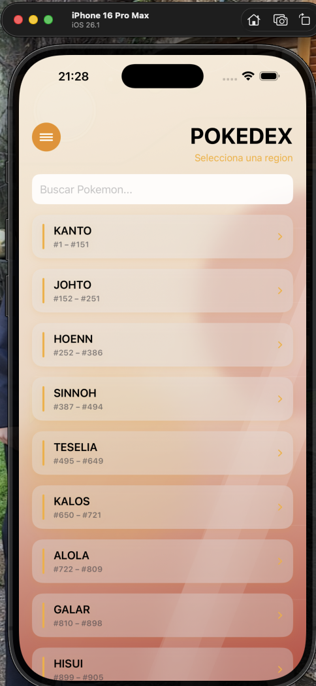
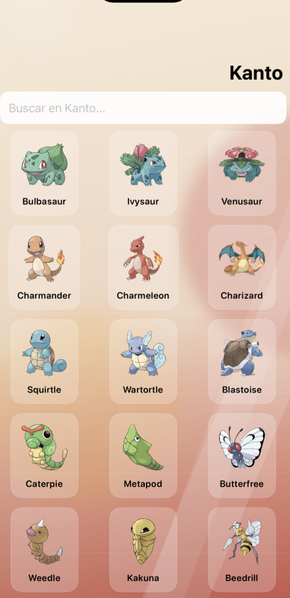
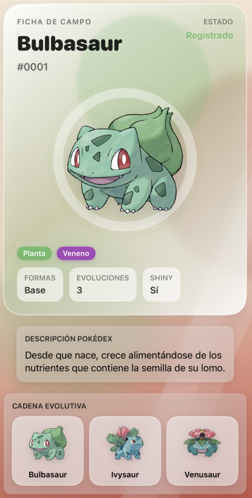
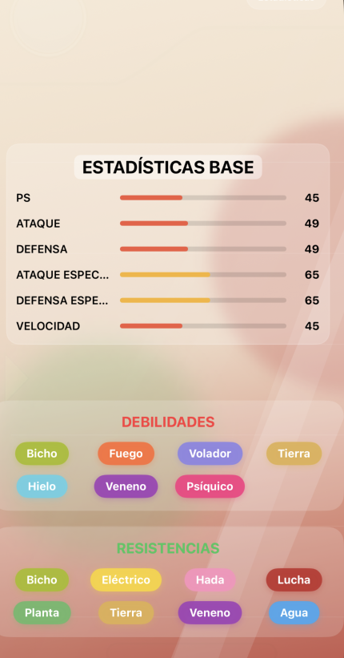
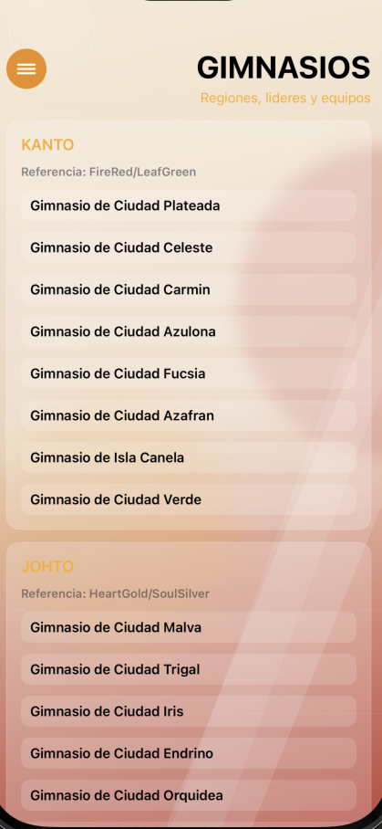
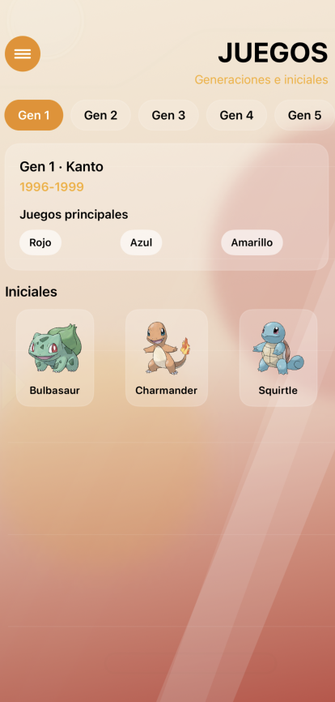
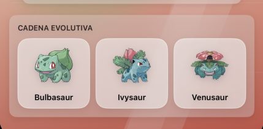
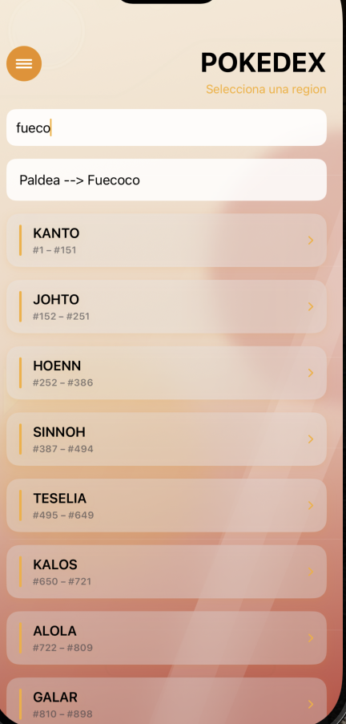

# Swift Pokédex

Pokédex para iOS construida con **SwiftUI**, conectada a **PokeAPI**, diseñada como una base sólida para evolucionar hacia una enciclopedia Pokémon más completa.

La app ya permite explorar regiones, buscar Pokémon, abrir fichas detalladas, consultar evolución, shiny y formas especiales, además de recorrer gimnasios por región.

## Capturas de la App

| Selección de Región | Pokémon por Región | Ficha del Pokémon |
|:---:|:---:|:---:|
|  |  |  |
| **Estadísticas Base** | **Gimnasios por Región** | **Juegos por Generación** |
|  |  |  |
| **Cadena Evolutiva** | **Buscador Global** | |
|  |  | |

## Qué ofrece hoy

- Exploración de la Pokédex nacional organizada por regiones.
- Búsqueda global por nombre o número.
- Fichas detalladas con arte oficial, tipos, estadísticas, debilidades y resistencias.
- Descripción Pokédex en español cuando está disponible.
- Cadena evolutiva navegable.
- Soporte para shiny, Mega Evolución y Gigantamax.
- Navegación por gestos entre Pokémon.
- Sección de gimnasios con líderes, especialidades, insignias y equipos.
- Interfaz localizada al español.
- Mejoras de performance con caché y precarga de detalle.

## Stack

- `Swift`
- `SwiftUI`
- `Observation` (iOS 17+)
- `PokeAPI v2`
- `Xcode`

## Arquitectura resumida

La app está pensada con dos objetivos:
1. Ofrecer una experiencia visual cuidada tipo Pokédex moderna.
2. Mantener una base técnica lo suficientemente limpia como para crecer hacia una enciclopedia más ambiciosa.

Por eso la UI no depende directamente de la API: el acceso a datos pasa por una capa de repositorio y un cliente desacoplado.

- `Views`: pantallas y componentes visuales.
- `ViewModels`: estado y coordinación de carga reactiva con `@Observable`.
- `PokemonRepository`: fachada principal para datos Pokémon.
- `PokeAPIClient`: abstracción para el acceso a PokeAPI.
- `Models`: modelos de dominio y modelos auxiliares.

## Estado del proyecto

El proyecto ya tiene una base visual y funcional sólida, y está en una etapa ideal para seguir creciendo en tres direcciones:

- Performance.
- Contenido enciclopédico.
- Migración a un backend propietario de Spring Boot.

## Roadmap sugerido

- Despliegue de backend en Java / Spring Boot para reemplazar el consumo directo de PokeAPI.
- Caché persistente en disco (posible integración con SwiftData).
- Expansión hacia juegos, liga y contenido enciclopédico.
- Unificación visual del resto de pantallas con el nuevo lenguaje del detalle.

## Cómo correrlo

1. Abrir `Pokedex-v1.1.xcodeproj` en Xcode.
2. Seleccionar el target de la app.
3. El proyecto requiere un Simulador o dispositivo físico con **iOS 17 o superior**.
4. Ejecutar el proyecto.

La app requiere conexión a internet para cargar datos remotos.

## Documentación técnica

Para una explicación más completa de la arquitectura, el flujo de datos y el roadmap técnico, ver:

[`DOCUMENTATION.md`](./DOCUMENTATION.md)
